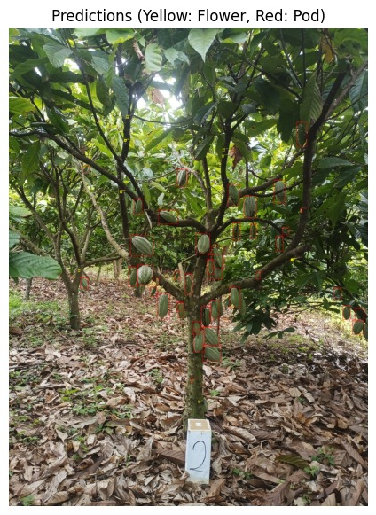
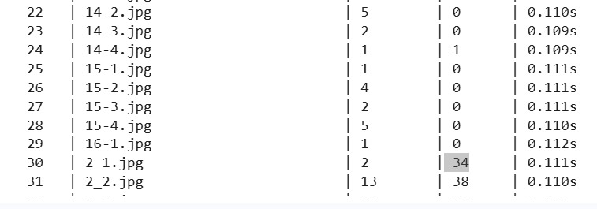

# Cocoa Flower and Cocoa Pod Detection Using Deep Learning

## Project Overview
This repository presents a deep learning based object detection pipeline for identifying cocoa flowers and cocoa pods in natural field images. The objective of this project is to demonstrate the application of modern object detection techniques for agricultural monitoring under limited data conditions.

The project focuses on two key components. First, a label consistent data augmentation pipeline is implemented to address data scarcity. Second, a deep learning based object detection model is trained using a two stage detection framework.

This work is developed as a course project for the subject **Deep Learning** and is intended strictly for academic and educational purposes.

## Key Contributions
- Label consistent data augmentation for object detection
- Robust handling of Pascal VOC XML annotations
- Automatic validation and filtering of invalid bounding boxes
- Training of a Faster R CNN based detector
- IoU based quantitative evaluation
- Visualization of ground truth annotations and model predictions

## Dataset Description
The dataset consists of RGB images collected under real field conditions.

**Dataset statistics**
- Original images: 18
- Augmented images: 54
- Total images: 72

**Object classes**
- Cocoa flower
- Cocoa pod

**Annotation format**
- Pascal VOC XML

Due to the limited size of the original dataset, data augmentation plays a critical role in improving model robustness and generalization.

## Data Augmentation
A comprehensive data augmentation pipeline is implemented to increase dataset diversity while preserving annotation correctness.

Applied augmentation techniques include:
- Geometric transformations such as flipping, rotation, scaling, and translation
- Color and lighting variations including brightness, contrast, hue, and saturation
- Noise and blur effects to simulate real world acquisition conditions
- Random cropping followed by resizing

Bounding boxes are transformed jointly with images. Invalid bounding boxes, extremely small boxes, and boxes outside image boundaries are automatically filtered.

## Model Architecture
The object detection model is based on the Faster R CNN framework.

**Model configuration**
- Detection framework: Faster R CNN
- Backbone network: ResNet50 with Feature Pyramid Network
- Pretrained weights: COCO dataset
- Detection head customized for background, cocoa flower, and cocoa pod classes

A two stage detection architecture is selected to prioritize detection accuracy and localization performance.

## Training Configuration
The model is trained using the PyTorch and Torchvision libraries.

**Training settings**
- Optimizer: Stochastic Gradient Descent
- Learning rate: 0.005
- Batch size: 2
- Training epochs: 100
- Execution environment: Google Colab with GPU support

## Evaluation Methodology
Model performance is evaluated using an Intersection over Union based matching strategy on the validation dataset.

**Evaluation parameters**
- Confidence threshold: 0.7
- IoU threshold: 0.7

**Reported metrics**
- Precision
- Recall
- F1 score

Mean Average Precision is not reported due to the very small dataset size. The selected metrics provide interpretable performance evaluation under strict localization constraints.
## Performance Analysis

To validate the real-world efficiency of the model, a comparative study was conducted between manual human counting and the AI model on a representative field image (Image 2.2).

### 1. Detection Accuracy (Case Study)
| Object Class | Manual Count (Ground Truth) | AI Model Detection | Accuracy vs Manual |
| :--- | :--- | :--- | :--- |
| **Cocoa Flowers** | 19 | 13 | 68.4% |
| **Cocoa Pods** | 40 | 38 | **95.0%** |
| **Total Objects** | **59** | **51** | **86.4%** |

*Observation:* The model achieved high accuracy (95%) on Cocoa Pods, which are the primary yield indicators. Flower detection proved more challenging due to the small size of objects, yet the model still captured the majority of instances.

### 2. Time Efficiency
The most significant advantage of this pipeline is the drastic reduction in processing time.

* **Manual Counting Time:** 2 minutes (120 seconds)
* **AI Processing Time:** 0.11 seconds

> **Result:** The AI model is approximately **1,090x faster** than manual inspection. This demonstrates that the system can process large datasets in seconds, whereas manual counting would require hours of labor.

### 3. Visual Proof
Here are the screenshots from our experiment:

| AI Detection Result | Time Computation Log |
| :---: | :---: |
|  |  |
*Figure 1: Left: AI detecting flowers/pods. Right: Log showing 0.11s inference time.*

## Project Structure

data/
images/
labels/

augmented_data/
images/
labels/

src/
data_augmentation.py
dataset_loader.py
train_model.py
evaluation.py

notebooks/
experiments.ipynb

## Installation and Setup
1. Clone the repository from GitHub
2. Create a Python virtual environment
3. Install dependencies using `requirements.txt`
4. Run the data augmentation script
5. Train the detection model

Install dependencies using the following command in a local environment or Google Colab.

## Usage
- Run the data augmentation script to generate augmented samples
- Train the Faster R CNN model using the training script
- Evaluate the trained model using IoU based metrics
- Visualize ground truth annotations and prediction results

## Limitations
This project is conducted on a very small dataset, which limits generalization. The results should be interpreted as a proof of concept rather than a production ready system.

## Future Work
- Collection of larger and more diverse datasets
- Evaluation using mean average precision
- Comparison with one stage detectors such as YOLO
- Deployment for real time agricultural monitoring

## Acknowledgment
Image data were collected through field work by collaborators. This project is developed strictly for academic and educational purposes.

## Citation
If you use or reference this work, please cite it as a course project.
